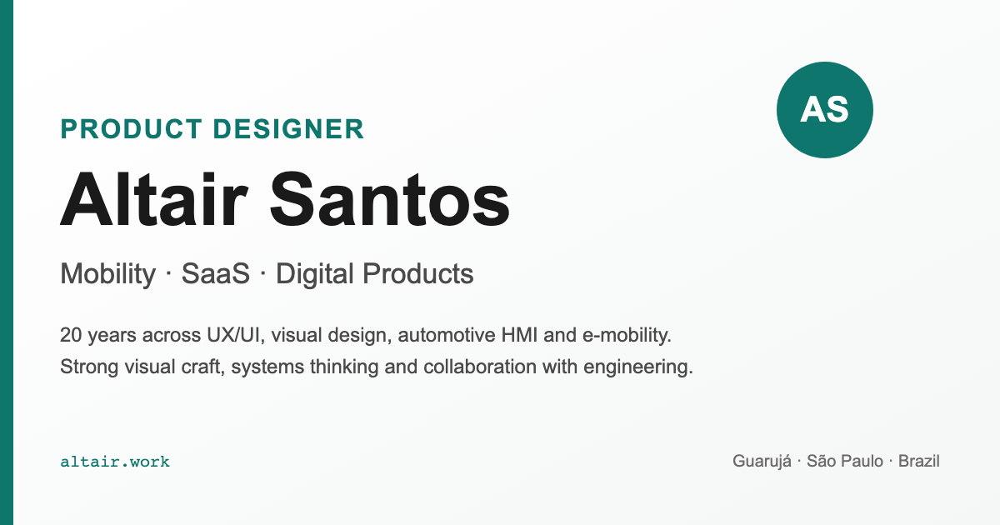

# Currículo digital · Altair Santos

CV web estático em **HTML5 + CSS3 puro**, com versões em português e inglês, foco em performance, SEO, impressão em PDF e acessibilidade auditável.

**Produção pretendida:** <https://altair.work>

Este projeto foi adaptado a partir do repositório open-source de Bené Aragão, preservando a proposta original: um currículo web que também funciona como peça de portfólio técnico.



## Estrutura

```text
.
├── altair-cv/
│   ├── index.html          # Versão PT-BR
│   ├── en/index.html       # Versão EN
│   ├── styles.css          # Tokens, layout, responsivo, print e a11y
│   ├── robots.txt
│   ├── sitemap.xml
│   └── assets/
│       ├── favicon.svg
│       ├── og-image.svg
│       └── og-image.png
├── tests/
│   ├── a11y.spec.js
│   ├── keyboard.spec.js
│   ├── regen-og.js
│   └── package.json
└── README.md
```

## Rodar localmente

```bash
cd altair-cv
python3 -m http.server 4321
```

Abrir:

- PT-BR: <http://localhost:4321/>
- EN: <http://localhost:4321/en/>

## Validar

```bash
cd tests
npm install
BASE_URL=http://localhost:4321/ npm test
BASE_URL=http://localhost:4321/en/ npm run test:keyboard
BASE_URL=http://localhost:4321/en/ npm run test:a11y
```

O script `test:html` valida as duas páginas. Os testes de teclado e axe usam a rota definida em `BASE_URL`.

## Gerar Open Graph

Depois de editar `altair-cv/assets/og-image.svg`:

```bash
node tests/regen-og.js
```

Isso recria `altair-cv/assets/og-image.png` em 1200x630.

## Publicar

O deploy usa GitHub Pages via GitHub Actions. No primeiro setup, configure **Settings → Pages → Build and deployment → Source → GitHub Actions** no repositório.

Depois, cada `push` na `main` roda a auditoria e publica a pasta `altair-cv/`.

Veja [DEPLOY.md](./DEPLOY.md).

## Conteúdo

Para adaptar este projeto ao seu próprio currículo, comece extraindo uma base estruturada a partir de um CV existente, LinkedIn, portfólio ou histórico profissional. Você pode usar sua ferramenta de IA preferida para transformar esse material em um briefing claro antes de editar o HTML.

Prompt sugerido:

```text
Com base no currículo, LinkedIn, portfólio e informações profissionais abaixo, gere um briefing estruturado para adaptar um currículo web.

Inclua:
- identidade profissional;
- headline curta;
- resumo profissional em 3 a 5 linhas;
- destaques rápidos com resultados mensuráveis;
- skills agrupadas por tema;
- experiências recentes com responsabilidades, impacto e stack;
- projetos selecionados;
- trajetória anterior;
- formação;
- certificações;
- idiomas;
- SEO: título, descrição curta e palavras-chave.

Seja factual. Não invente métricas. Quando algo estiver incerto, marque como "confirmar". Gere também uma versão em inglês profissional, natural e sem tradução literal.
```

Depois, substitua o conteúdo em `altair-cv/index.html` e `altair-cv/en/index.html`, revisando metadados, links, Open Graph, sitemap e textos de acessibilidade.

## Crédito

Base original: currículo digital open-source de Bené Aragão.  
Adaptação: Altair Santos.

## Licença

MIT. Veja `LICENSE`.
